# Phân tích tình hình tài chính và định giá cổ phiếu BID

Dự án này được thực hiện nhằm phân tích các chỉ số tài chính và biến động giá cổ phiếu, từ đó đưa ra dự báo về định giá cổ phiếu trong tương lai. Thông qua việc áp dụng các phương pháp phân tích dữ liệu và mô hình dự đoán, dự án hướng đến việc cung cấp cái nhìn sâu sắc về tình hình tài chính doanh nghiệp cũng như tiềm năng tăng trưởng của cổ phiếu. Mục tiêu cuối cùng là hỗ trợ nhà đầu tư đưa ra những quyết định đầu tư thông minh và chính xác hơn.

## Quy trình:

### 1. Thu thập dữ liệu:

- Dữ liệu tài chính: báo cáo kết quả kinh doanh, bảng cân đối kế toán, báo cáo lưu chuyển tiền tệ;
- Dữ liệu thị trường: Giá cổ phiếu, chỉ số thị trường và các yếu tố vĩ mô khác

### 2. Làm sạch dữ liệu

- Kiểm tra dữ liệu
- Xử lý dữ liệu sai định dạng (string to float)

### 3. Tính toán các chỉ số

- Các chỉ số tài chính

  - NIM = thu nhập lãi thuần/ tài sản sinh lời bình quân
  - Tăng trưởng thu nhập lãi thuần = [(thu nhập lãi thuần kỳ này- thu nhập lãi thuần kỳ trước)/ thu nhập lãi thuần kỳ trước]\*100%
  - Tăng trưởng lãi thuần từ hoạt động dịch vụ = [(lãi từ hoạt động dịch vụ kỳ này - lãi từ hoạt động kỳ trước)/ lãi từ hoạt động kỳ trước]\*100%
  - Tăng trưởng thu nhập hoạt động = [(thu nhập hoạt động kỳ này - thu nhập hoạt động kỳ trước)/ thu nhập hoạt động kỳ trước]\*100%
  - Tăng trưởng LNST = [(LNST kỳ này - LNST kỳ trước)/ LNST kỳ trước]\*100%
  - Thu nhập ngoài lãi = tổng thu nhập hoạt động - thu nhập lãi thuần
  - Cơ cấu thu nhập ngoài lãi( dịch vụ, ngoại hối, mua bán chứng khoán kinh doanh, mua bán chứng khoán đầu tư)
  - Tỉ lệ CIR = chi phí hoạt động/ thu nhập hoạt động
  - Cơ cấu nợ xấu & nợ cần chú ý

- Các chỉ số để định giá
  - BVPS = VCSH/ số lượng cổ phiếu đang lưu hành
  - P/B = giá cổ phiếu/ BVPS
  - Tính độ lệch chuẩn, std±1, std±2

### 4. Sử dụng mô hình hồi quy

- Dự đoán BVPS trong tương lai
- Dự đoán P/B trong tương lai

### 5. Trực quan hóa dữ liệu

### 6. Phân tích

- Phân tích báo cáo tài chính: đánh giá hiệu suất tài chính của công ty thông qua các chỉ số tài chính
- Phân tích chiến lược kinh doanh và tiềm năng phát triển của công ty

### 7. Định giá cổ phiếu

- Áp dụng phương pháp P/B: P/B dự phóng ở mức 2.42x tương đương độ lệch chuẩn +1 của trung bình P/B 5 năm của BID, dựa trên triển vọng các chỉ số tài chính cải thiện cũng như kế hoạch tăng vốn điều lệ thêm 23.9% sắp tới.
- Khuyến nghị trung lập: giá 53,200 đ/cp

link report: [BID_report](BID_report.pdf)

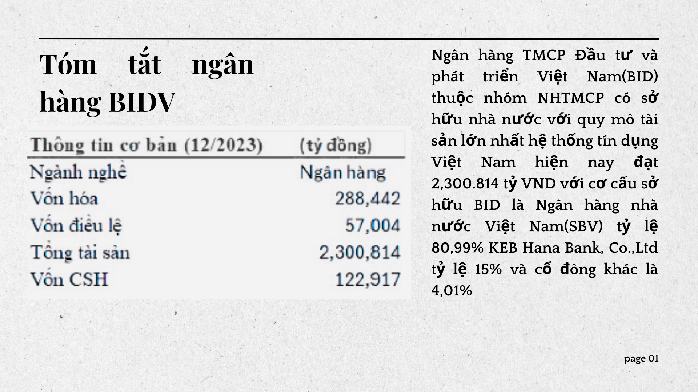

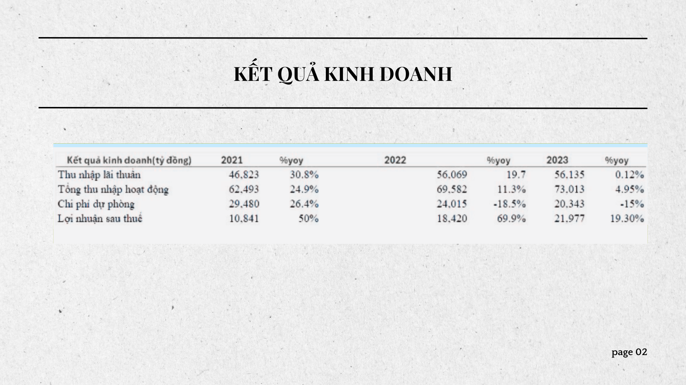

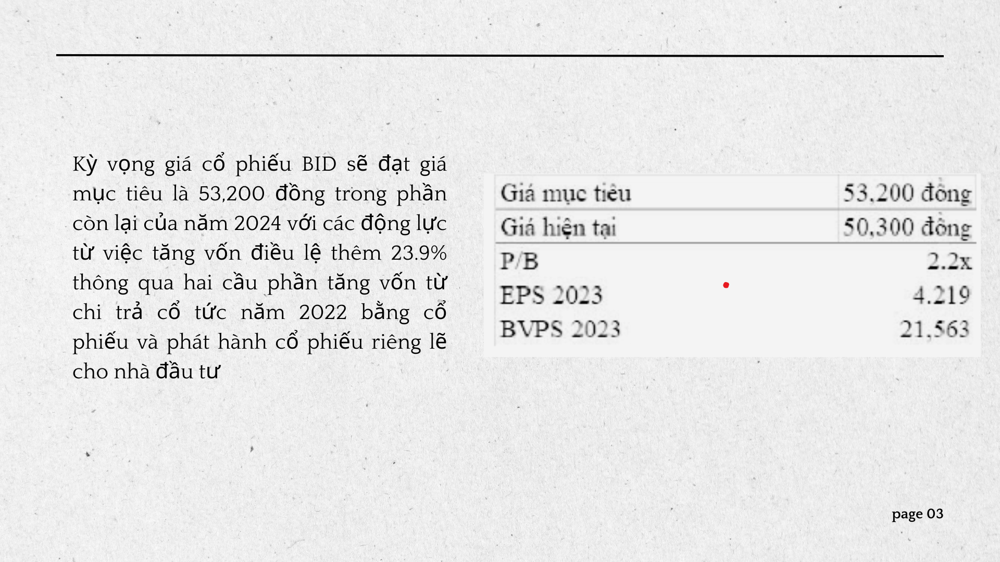

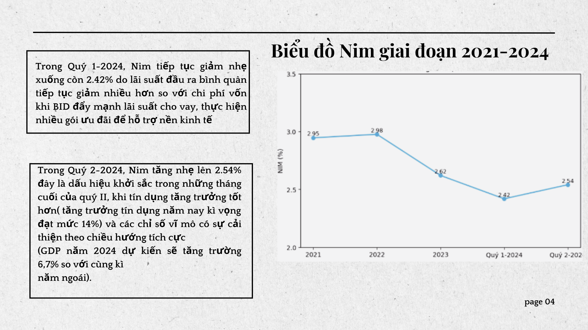

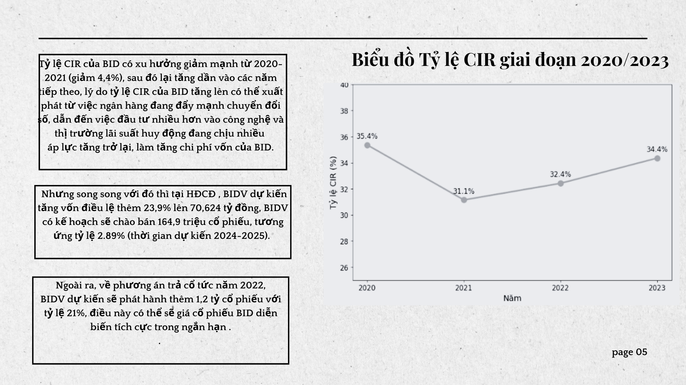

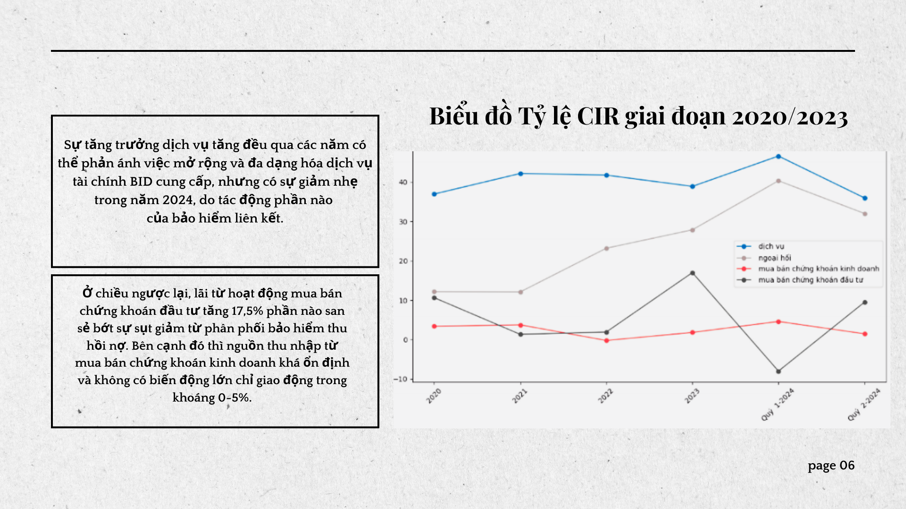

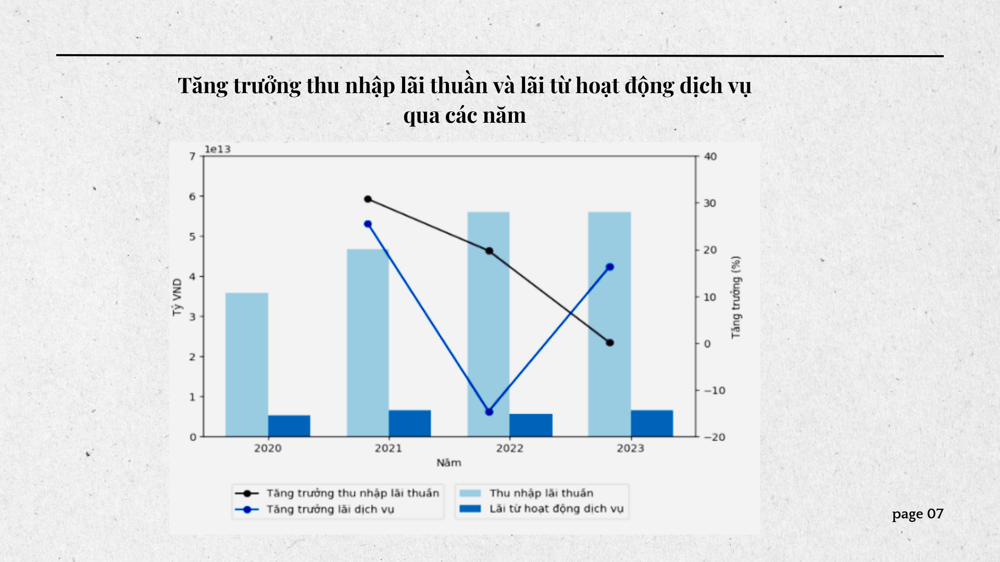

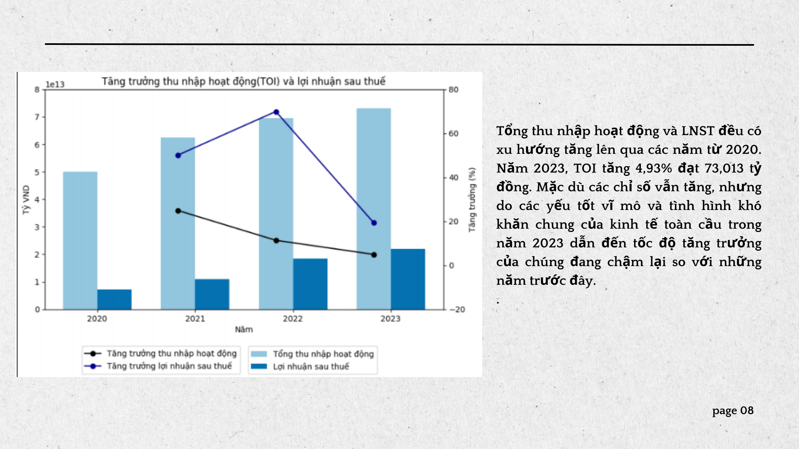

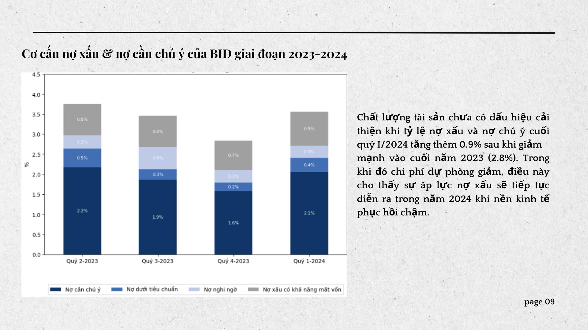

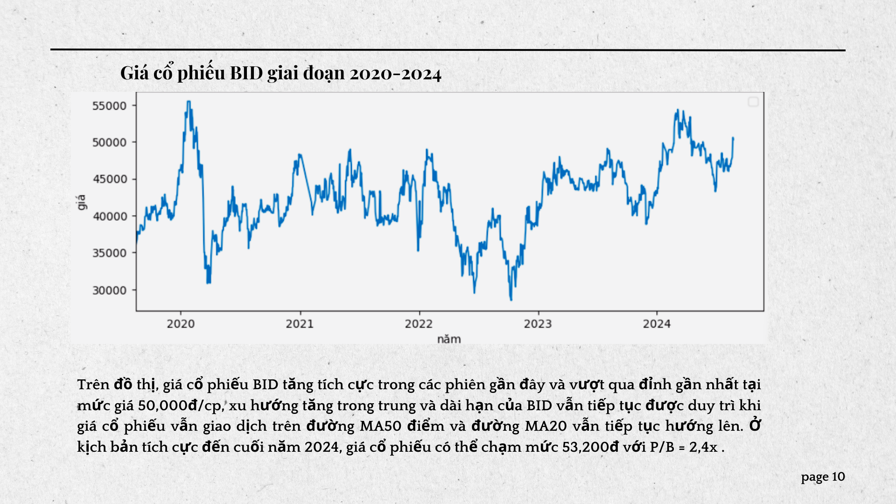

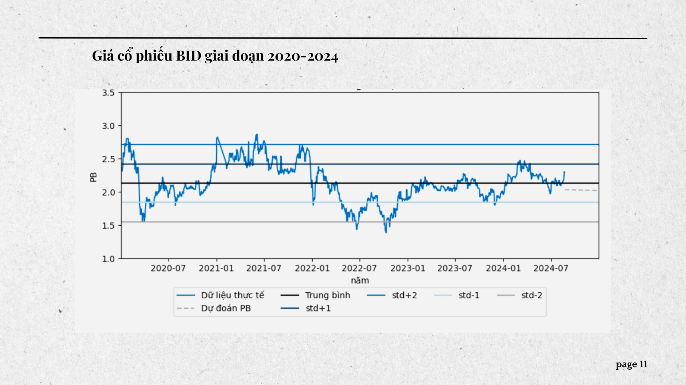

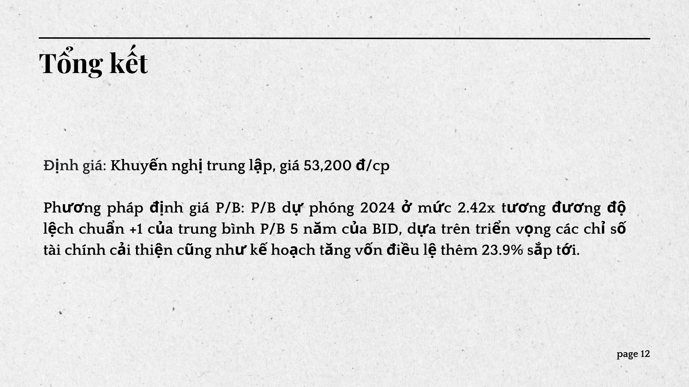
